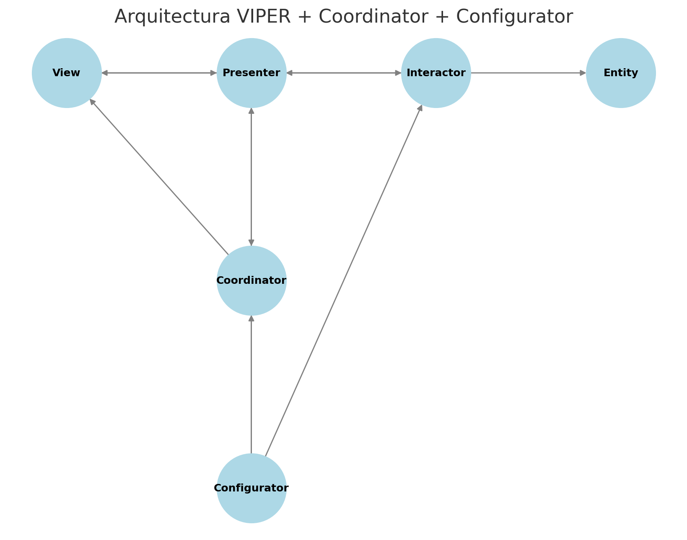
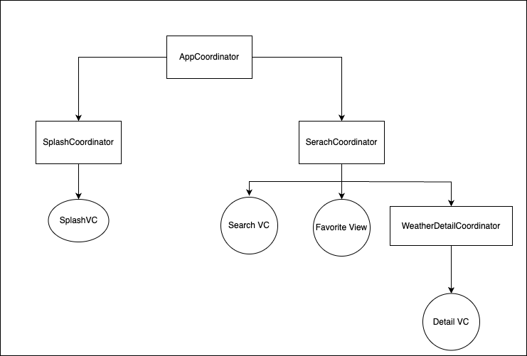
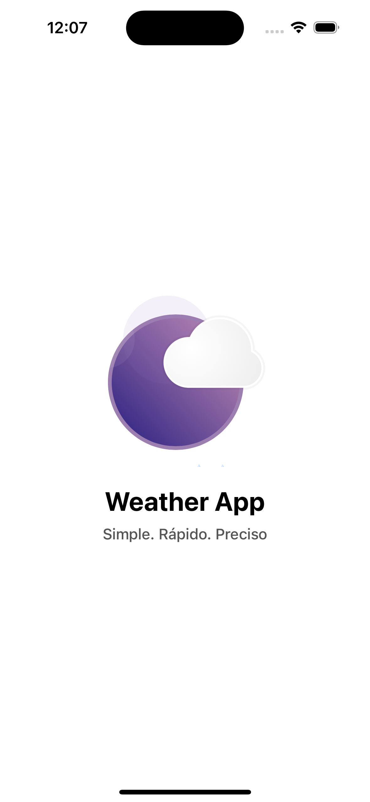
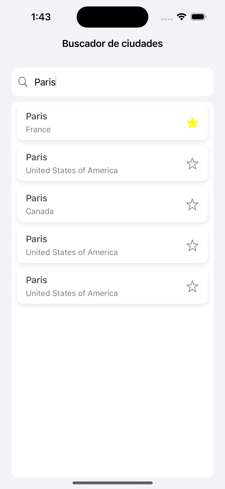
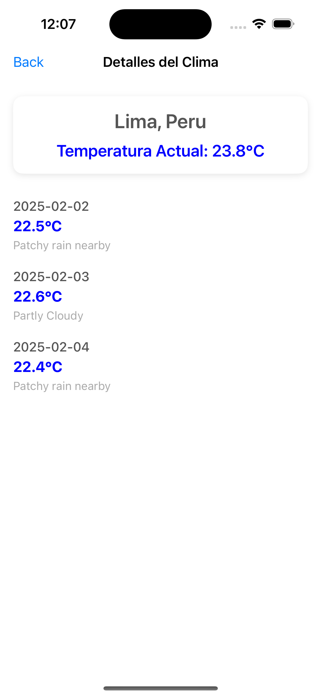

# 🌦️ WeatherApp - iOS

## 📌 Descripción del Proyecto
WeatherApp es una aplicación iOS desarrollada en **Swift**, que permite a los usuarios buscar ubicaciones y visualizar la información meteorológica actual y el pronóstico de los próximos 4 días. La aplicación implementa **VIPER**, **Coordinator Pattern** y **Configurator Pattern** para garantizar una arquitectura modular, escalable y de fácil mantenimiento.

---

## 🚀 Arquitectura: VIPER + Coordinator + Configurator

### 📌 **¿Por qué VIPER?**
VIPER (View, Interactor, Presenter, Entity, Router) permite una separación clara de responsabilidades, mejorando la **testabilidad** y la **escalabilidad**. Cada módulo tiene capas bien definidas, lo que evita el código espagueti y facilita la extensión del sistema.

### 📌 **VIPER + Coordinator Pattern**
El **Coordinator Pattern** se implementó para manejar la navegación de manera más desacoplada, eliminando la dependencia del `Router` dentro del `Presenter`. Esto permite:
✅ Reutilización de flujos de navegación.  
✅ Pruebas unitarias sin necesidad de UI real.  
✅ Mayor flexibilidad en la navegación.

### 📌 **VIPER + Configurator Pattern**
El **Configurator Pattern** se utilizó para gestionar la inyección de dependencias en cada módulo sin que los `Coordinators` o `Presenters` tengan que crearlas directamente. Esto **mejora la modularidad** y **evita el acoplamiento innecesario**.

### 📌 **Diagrama de Arquitectura VIPER + Coordinator**



### 📌 **Diagrama de Coordinator pattern**


---

## 📐 Patrones de Diseño Utilizados

✅ **VIPER** → Separación de responsabilidades para módulos desacoplados.  
✅ **Coordinator Pattern** → Manejo de navegación fuera de los `Presenters`.  
✅ **Configurator Pattern** → Gestión centralizada de dependencias.  
✅ **Repository Pattern** → Abstracción de la capa de datos.  
✅ **Result Type** → Manejo de errores estructurado con `Result<T, Error>`.  
✅ **Factory Pattern** → Creación desacoplada de dependencias.  
✅ **Singleton Pattern** → Manejo eficiente de instancias persistentes.  

---

## 📸 Capturas de la Aplicación

| Splash | Búsqueda | Detalles |
|--------|---------|----------|
|  |  |  |

---

## 🚀 Integración Continua (CI)

Este proyecto cuenta con un proceso de **Integración Continua (CI)** mediante **GitHub Actions**. Este flujo de trabajo se encarga de ejecutar las pruebas unitarias de Xcode en cada `push` o `pull request` a la rama `main`.

### 📌 **¿Cómo funciona el CI?**
1. En cada **push** o **pull request** a la rama `main`, se ejecuta un workflow definido en `.github/workflows/ci.yml`.
2. Utiliza un runner de **macOS** con la última versión de **Xcode**.
3. **Instala dependencias** si el proyecto usa CocoaPods.
4. **Compila y ejecuta** las pruebas en un simulador de iPhone.
5. Si todas las pruebas **pasan**, el workflow finaliza con éxito ✅.
6. Si alguna prueba **falla**, GitHub mostrará un ❌ y no permitirá la fusión del PR hasta que los errores sean corregidos.

### ⚙️ **Ejecución manual**
Si deseas ejecutar las pruebas manualmente desde el terminal en tu máquina local, usa:
```bash
xcodebuild test \
  -workspace WeatherApp.xcworkspace \
  -scheme WeatherApp \
  -destination 'platform=iOS Simulator,name=iPhone 14,OS=latest' \
  CODE_SIGN_IDENTITY="" CODE_SIGNING_REQUIRED=NO
```


### 📂 **Ubicación del archivo CI**
El flujo de trabajo está definido en:
```bash
.github/workflows/ci.yml
```

### 📊 **Ver los resultados**
Para ver la ejecución del workflow:
1. **Ir a la pestaña "Actions"** en GitHub.
2. Seleccionar el workflow **"iOS Unit Tests"**.
3. Revisar los logs de la ejecución.

### 🚀 **Beneficios del CI en el proyecto**
- 📌 **Automatización**: No es necesario ejecutar pruebas manualmente en cada cambio.
- 🔥 **Detección temprana de errores**: Si algo se rompe, lo sabremos inmediatamente.
- 🛡️ **Calidad del código**: Garantizamos que solo código probado y funcional se fusione a `main`.
- 💡 **Facilidad de integración**: Se ejecuta en cada `pull request`, asegurando estabilidad en el código base.

🚀 **Con este sistema de CI aseguramos que nuestro código esté siempre en buen estado antes de ser fusionado.** 🚀
---

## 🛠️ Tecnologías y Librerías Usadas
| Tecnología | Descripción |
|------------|------------|
| **Swift 5.9** | Lenguaje de programación principal |
| **UIKit** | Framework de UI utilizado en la aplicación |
| **Lottie** | Animaciones en la pantalla de Splash |
| **UserDefaults** | Persistencia de datos para favoritos |
| **WeatherAPI** | API externa para obtener datos meteorológicos |
| **XCTest** | Framework para pruebas unitarias y de UI |
| **Dependency Injection** | Para mejorar la testabilidad y desacoplar dependencias |

---

## 🧪 Pruebas Unitarias y UI
Se implementaron pruebas en **XCTest** para garantizar la estabilidad del código:

✅ **Pruebas unitarias en `Interactor` y `Presenter`** (WeatherDetails, Search).  
✅ **Mocks para Interactor, View, Repository y Coordinator** para pruebas aisladas.  
✅ **Pruebas de UI en `XCTest UI`** para validar flujos de usuario (búsqueda, favoritos, navegación).  

**Ejecutar las pruebas:**
```bash
CMD + U  # En Xcode
```
## 📦 Instalación y Ejecución

### 1️⃣ Clonar el repositorio
```bash
git clone https://github.com/tuusuario/weatherapp.git
cd weatherapp
```

### 2️⃣ Instalar dependencia
```bash
pod install 
```
### 3️⃣ Abrir el proyecto en Xcode
```bash
xed .
```
